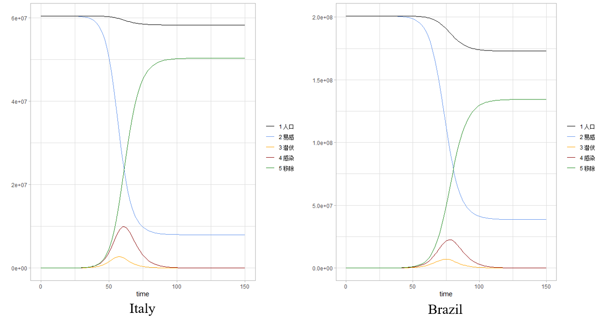

### 演示内容

### 1 绪论

### 2 研究方法

### 3 实证分析

### 4 讨论

---

class: center, middle

## 1 绪论

---

### 1.1 研究背景

&emsp;&emsp;COVID-19是一项重大的公共卫生事件。尽管各国政府采取了各种措施来保护城市或国家，例如交通限制、旅行者隔离要求、接触者追踪等，但大规模的全球人口流动已经引起该疾病的迅速传播，使其在全世界蔓延。疫情在中国得到控制的同时，COVID-19的全球传播已造成在亚洲、欧洲、中东和北美激增。

--

&emsp;&emsp;COVID-19构成全球性大流行，蔓延到世界上大多数国家和地区。通过了解某个地区确诊病例的发展趋势，政府可以采取相应的政策以控制应对疫情。但是，单一的模型估计可能会得出有偏的结果，不同数学模型产生的预测结果是不一致的。

--

&emsp;&emsp;因此，我们基于SEIR模型和LSTM模型，将模拟结果与实际数据进行比较，试图得出客观的结论。

---

### 1.2 文献综述

--

&emsp;&emsp;[1]Zifeng Yang,Zhiqi Zeng. “Modified SEIR and AI prediction of the epidemics trend of COVID-19 in China under public health interventions.” Journal of Thoracic Disease(2020).

&emsp;&emsp;Zifeng Yang和Zhiqi Zeng基于SEIR模型，预测中国疫情规模在2月下旬达到顶峰，到4月底逐步下降。如果将武汉封城时间推迟五天，中国大陆的疫情规模将增加三倍。

--

&emsp;&emsp;[2]卿登莉，火斌昌，杨凤. 大数据视角下遏制新型冠状病毒的举措成效分析[J].统计与管理（2020）

&emsp;&emsp;根据SEIR模型计算有效再生数降为1的时间点，可以看出湖北和全国疫情“拐点”在3月初均已出现。

--

&emsp;&emsp;[3]M.Liu, J.Ning, Y.Du, J.Cao, D.Zhang, J.Wang, M.Chen. Modelling the evolution trajectory of COVID-19 in Wuhan, China: experience and suggestions.

&emsp;&emsp;SEIR模型可有效地捕获了COVID-19的演变轨迹，有效预测COVID-19的峰值，大小和持续时间。

---

&emsp;&emsp;[4]Bingjie Yan, Xiangyan Tang, Boyi Liu, Jun Wang, Yize Zhou, Guopeng Zheng, Qi Zou, Yao Lu, Wenxuan Tu “An Improved Method for the Fitting and Prediction of the Number of COVID-19.” arXiv preprint arXiv：2005.03446(2020).

&emsp;&emsp;LSTM神经网络的拟合度更接近实际值,预测精度较高。

--

&emsp;&emsp;[5]Vinay Kumar Reddy Chimmula, Lei Zhang, Time Series Forecasting of COVID-19 transmission in Canada Using LSTM Networks, Chaos, Solitons and Fractals (2020).

&emsp;&emsp;使用LSTM网络，结果显示爆发的可能终点是2020年6月左右。此外，还比较了加拿大、意大利和美国的传播率，结果表明美国的传播率最高，加拿大的传播率最低。

--

&emsp;&emsp;[6]Novanto Yudistira .“COVID-19 growth prediction using multivariate long short term memory.” arXiv preprint arXiv :2005.04809v1(2020).

&emsp;&emsp;使用LSTM方法来了解covid-19随时间增长的相关性。发现随着时间的推移很难获得完全相同数量的确诊病例，但是LSTM能够在实际和预测之间提供相似的模式。结果表明，LSTM是一种有前途的预测工具通过从大数据中学习并潜在地传播covid-19大流行能够预测未来的爆发。

---

### 1.3 数据来源

&emsp;&emsp;COVID-19疫情数据来自约翰霍普金斯大学系统科学与工程中心（CSSE）提供的COVID-19全球数据库（https://github.com/CSSEGISandData/COVID-19 or https://coronavirus.jhu.edu/map.html）。

---

class: center, middle

## 2 研究方法

---

### 2.1 SEIR模型

&emsp;&emsp;SEIR模型是带潜伏期的恶性传染病模型。SEIR模型假设总人口不变，将人群分类，每种类型作为一个“仓室”存在，假设在同一“仓室”中的每个个体具有相同的特征。

- $\beta$： $\beta=k*b$ 是与感染者进行接触的人数 $k$ 和接触后感染概率 $b$ 的乘积
- $\sigma$：潜伏者转化为感染者的概率
- $\gamma$： $\gamma=1/D$ 是感染人群中恢复健康或者死亡的平均比率，其中 $D$是感染的平均持续时间

```{r fig.align='center', echo=FALSE}

```

---

&emsp;&emsp;SEIR模型的实质是一个关于时间的常微分方程组。它预测的疾病趋势仅取决于参数和开始时间。

$$\begin{cases}
\dfrac{dS}{dt}=-\dfrac{\beta SI}{N}\\
\dfrac{dE}{dt}=\dfrac{\beta SI}{N}-\sigma E\\
\dfrac{dI}{dt}=\sigma E-\gamma I\\
\dfrac{dR}{dt}=\gamma I\\
\end{cases}$$

---

### 2.2 LSTM模型

&emsp;&emsp;LSTM模型（Long Short-Term Memory）是一种用于深度学习领域的RNN神经网络。

--

&emsp;&emsp;RNN是在普通神经网络的基础上增加了隐藏层各单元之间的联系，通过权重将上一个时间序列的值传递到当前的神经元上，上一个时间序列的数据信息可以影响当前时间序列的数据信息，以此来达到记忆功能。虽然RNN具备了记忆功能，但不能记忆太前或者太后的数据，即无法解决长期依赖问题。

```{r fig.align='center', echo=FALSE}
knitr::include_graphics("image/RNN.png")
```

---

&emsp;&emsp;LSTM模型在隐藏层各神经元单元之间增加记忆单元，从而控制时间序列信息，每次在LSTM隐藏层的各单元传递时，可通过几个可控门（gate）来控制之前的数据信息和当前数据信息的记忆和遗忘程度，从而达到使RNN记忆更长时间的信息。LSTM增加了记忆功能的可控性。

```{r fig.align='center', echo=FALSE}
knitr::include_graphics("image/LSTM.png")
```

---

class: center, middle

## 3 实证分析

---

### 3.1 SEIR模型的模拟评估

```{r fig.align='center', echo=FALSE}

```

---

||累计确诊|死亡率|治愈率|占比|
|:-:|:-:|:-:|:-:|:-:|
|Brazil|438812|5.0%|23.6%|0.0022|
|France|186238|9.7%|19.6%|0.0028|
|Germany|182452|2.3%|42.9%|0.0022|
|Italy|231732|10.4%|23.5%|0.0038|
|Russia|379051|0.8%|10.4%|0.0026|
|Spain|284986|8.5%|32.6%|0.0061|
|UK|269127|11.1%|1.3%|0.0040|
|US|1768461|4.5%|7.9%|0.0054|

---

class: center, middle

```{r fig.align='center', echo=FALSE}

```

---

class: center, middle

```{r fig.align='center', echo=FALSE}

```

---

class: center, middle

```{r fig.align='center', echo=FALSE}

```

---

class: center, middle

```{r fig.align='center', echo=FALSE}

```

---

class: center, middle

||Brazil|France|Germany|Italy|Russia|Spain|UK|US|
|:-:|:-:|:-:|:-:|:-:|:-:|:-:|:-:|:-:|
|Days to Peak|81|80|169|85|51|130|49|55|
|Peak value( $*10^4$ active)|2261.3|744.5|104.3|499.5|6290|117.5|2965.8|13643|

---

### 3.2 LSTM模型的模拟评估

- 损失函数：

$$MAE=\frac{1}{n}\sum_{i=1}^{n}|y_i-\hat y_i|$$

--

$$MSE=\frac{1}{n}\sum_{i=1}^{n}(y_i-\hat y_i)^2$$

--


$$Huber Loss:L_\delta (y,\hat y)=\begin{cases}
\dfrac{1}{2}(y-\hat y)^2 & for\ |y-\hat y| \leq \delta \\
\delta|y-\hat y|-\dfrac{1}{2}\delta^2 & otherwise 
\end{cases}$$

--

- optimizer：SGD，AdaGrad，RMSprop，AdaDelta，Adam

---

class: center, middle

```{r fig.align='center', echo=FALSE}

```

---

class: center, middle

```{r fig.align='center', echo=FALSE}

```

---

class: center, middle

```{r fig.align='center', echo=FALSE}

```

---

class: center, middle

```{r fig.align='center', echo=FALSE}

```

---

class: center, middle

```{r fig.align='center', echo=FALSE}

```

---

3.3 对比

- SEIR模型和LSTM模型的RMSE比较

||US|Russia|UK|Spain|Italy|Brazil|France|Germany|
|:-:|:-:|:-:|:-:|:-:|:-:|:-:|:-:|:-:|:-:|:-:|:-:|
|SEIR|10278735|19031588|1082278|32304|3905940|15498478|6065767|4315|
|LSTM|19200.5|6644.43|5508.75|1124.03|2031.12|12229.01|1674.55|1905.93|

--

- 全球确诊人数预测

||05/19|05/20|05/21|05/22|05/23|
|:-:|:-:|:-:|:-:|:-:|:-:|
|SEIR|106816753|120811582|136419044|153760588|172947403|
|LSTM|4897492|4996472|5102424|5210817|5310362|

---

class: center, middle

## 4 讨论

---

&emsp;&emsp;从数理模型的角度来看，SEIR模型是用来估计传染病的，而LSTM模型则运用于时间序列预测分析。与SEIR模型相比，LSTM模型可以更好地拟合已有数据，因为它是经过现有数据训练的，但是无法准确地判断和融合传染特征。因此认为LSTM模型更适用于短期内预测。另一方面，SEIR模型通过考虑多人群的相互作用和关联，引入了更多的变量和因素，更符合传染病发展规律，但是在考虑不同的干预措施时，预测结果会有很大差异。

--

&emsp;&emsp;本研究存在的一些局限性。

--

- 数据来源单一

--

- 随着疫情传播，各国政府采取不同程度的防疫措施，人们的防疫观念增强

--

- 没有考虑隐藏层数目、迭代次数对LSTM模型的影响

--

- 模型的可解释性

---

class: inverse, center, middle

# 谢谢！
