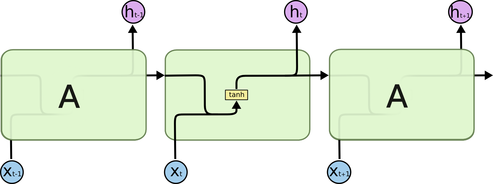

### 演示内容

### 1 绪论

### 2 研究方法

### 3 描述性统计分析

### 4 LSTM应用

---

class: center, middle

## 1 绪论

---

### 1.1 研究背景

&emsp;&emsp;COVID-19是一项重大的公共卫生事件。尽管各国政府采取了各种措施来保护城市或国家，例如交通限制、旅行者隔离要求、接触者追踪等，但大规模的全球人口流动已经引起该疾病的迅速传播，使其在全世界蔓延。疫情在中国得到控制的同时，COVID-19的全球传播已造成在亚洲、欧洲、中东和北美激增。

--

&emsp;&emsp;2020年2月下旬全球突然增加的病例引起了人们的深切关注。截至5月12日，全球新冠肺炎确诊病例累计达4098018例，死亡283271例，中国以外超过401万例。美国、俄罗斯、英国、西班牙、意大利、巴西、法国和德国为累计确诊人数的前八名国家。目前，各国仍在进行不同程度上的社会疏离，预测未来确诊病例的模型有助于了解当前的疫情趋势。

--

&emsp;&emsp;我们的研究聚焦于：能够根据历史数据，准确预测未来每个国家的确诊病例数。建立相关的预测模型，产生的预测结果对于制定和衡量公共干预策略具有重要意义。

---

### 1.2 文献综述

&emsp;&emsp;[1]陈亿雄,李苑,刘小明,李淑珍.长短记忆神经网络在流行性感冒暴发预测中的应用[J].江苏预防医学,2019,30(06):622-625.

&emsp;&emsp;陈亿雄等人选取2007-2017年深圳市宝安区每周流感发病数，利用长短记忆神经网络模型（long-short term memory，LSTM）预测未来每周流行性感冒（流感）暴发趋势的可行性，结果表明，相比ARIMA模型、BP神经网络、小波神经网络（WNN）、广义回归神经网络（GRNN）和动态自回归神经网络（NARX），LSTM神经网络的拟合度更接近实际值，预测精度较高。

--

&emsp;&emsp;[2]姚春晓. 基于长短时记忆神经网络的脑血管疾病预测系统研究[D].北京交通大学,2019.

&emsp;&emsp;姚春晓基于LSTM神经网络建立了脑血管疾病的预测模型，使用天坛医院提供的CNSR数据，对脑血管疾病进行预测，并将预测结果与支持向量机预测结果模型对比分析，发现LSTM有更高的准确率。

---

&emsp;&emsp;[3]黄鹏. 基于机器学习的乙类传染病预测模型研究与实现[D].电子科技大学,2019.

&emsp;&emsp;黄鹏使用6种数据来预测传染病，包括乙类传染病个案数据、地区编码数据、疾病编码数据、人口数据、天气数据、地区经济数据对乙类传染病进行预测。结果表明，LSTM 模型优于ARIMA模型。

--

&emsp;&emsp;[4]Vinay Kumar Reddy Chimmula, Lei Zhang, Time Series Forecasting of COVID-19 transmission in Canada Using LSTM Networks, Chaos, Solitons and Fractals (2020)
<https://doi.org/10.1016/j.chaos.2020.109864>

&emsp;&emsp;Vinay Kumar Reddy Chimmula, Lei Zhang根据约翰·霍普金斯大学和加拿大卫生部门提供的公共数据集基于截至2020年3月31日的可用数据。评估了关键特征，以预测加拿大和全球当前COVID-19爆发的趋势和可能的停止时间。在本文中，使用长期短期记忆（LSTM）网络，结果显示爆发的可能终点是2020年6月左右。此外，还比较了加拿大、意大利和美国的传播率，结果表明美国的传播率最高，加拿大的传播率最低。

---

### 1.3 数据来源

&emsp;&emsp;COVID-19疫情数据来自约翰霍普金斯大学系统科学与工程中心（CSSE）运营的COVID-19全球数据库（https://github.com/CSSEGISandData/COVID-19 or https://coronavirus.jhu.edu/map.html）。

---

## 2 研究方法

&emsp;&emsp;LSTM模型（Long Short-Term Memory）是一种用于深度学习领域的递归神经网络（RNN）架构。可以学习长期依赖信息。LSTM由Hochreiter & Schmidhuber（1997）提出，Alex Graves对其进行了改良和推广。在很多问题上，LSTM得到了广泛的使用，并取得相当巨大的成功。

```{r fig.align='center', echo=FALSE}

```

---

```{r fig.align='center', echo=FALSE}
knitr::include_graphics("image/structure.png")
```

```{r fig.align='center', echo=FALSE}

```

&emsp;&emsp; $x_t$ ：LSTM单元的输入向量&emsp;&emsp; $h_t$ ：LSTM单元的输出向量

---

### 2.1 LSTM核心思想

&emsp;&emsp;LSTM的核心是细胞状态（cell state）。

```{r fig.align='center', echo=FALSE}

```

---

&emsp;&emsp;门（gate）是一种可选择通过信息的节点，由 $\sigma$（sigmoid）神经网络层和逐点乘法运算组成。 

```{r fig.align='center', echo=FALSE}

```

&emsp;&emsp; $\sigma$ 层输出0到1之间的数值，描述每个信息量可以通过多少。0代表“不许任何量通过”，1代表“允许任意量通过”。

&emsp;&emsp;常见的LSTM单元由一个细胞、一个输入门、一个输出门和一个遗忘门组成。细胞会记住任意时间间隔内的值，并且三个门控制着进出单元的信息流。

---

### 2.2 LSTM理解

```{r fig.align='center', echo=FALSE}

```

$$f_t=\sigma(W_fx_t+U_fh_{t-1}+b_f)$$

其中， $f_t$ 是遗忘门的激活向量， $\sigma$ 是激活函数， $W$ 和 $U$ 是权重矩阵， $b$ 是偏差矢量参数。

---

```{r fig.align='center', echo=FALSE}

```

$$i_t=\sigma(W_ix_t+U_ih_{t-1}+b_i)$$
$$\tilde{C_t}=tanh(W_Cx_t+U_Ch_{t-1}+b_C)$$

其中， $i_t$ 是输入门的激活向量， $\tilde{C_t}$ 是细胞输入激活向量。

---

```{r fig.align='center', echo=FALSE}

```

$$C_t=f_t*C_{t-1}+i_t*\tilde{C_t}$$

其中， $C_t$ 是细胞状态向量。

---

```{r fig.align='center', echo=FALSE}

```

$$o_t=\sigma(W_ox_t+U_oh_{t-1}+b_o)$$

$$h_t=o_t*tanh(c_t)$$

其中， $o_t$ 是输入门的激活向量

---

## 3 描述性统计

```{r fig.align='center', echo=FALSE}

```

???

```{r echo=FALSE, message=FALSE, warning=FALSE}
library(ggplot2)
library(reshape2)
library(forcats)
data <- read.csv("data/confirmed.csv")
data <- melt(data,id.vars = "day", variable.name = "country", value.name = "num") 
num <- c(runif(73), runif(73, min=100, max=560000))
data$day <- fct_inorder(data$day)
ggplot(data = data, mapping = aes(x = day, y = num, colour = country,group = country )) +
  geom_line(size = 0.5) +
  geom_point(size = 1.5) +
  labs(title = "八个国家确诊人数",subtitle = "单位：人",x = '时间',y = '人数') +
  theme(axis.text.x = element_text(angle = 60, hjust = 0.5, vjust =0.5 ,size = 8))
```

---

```{r fig.align='center', echo=FALSE}

```

???

```{r echo=FALSE, message=FALSE, warning=FALSE}
library(ggplot2)
library(reshape2)
library(forcats)
data <- read.csv("data/confirmed(no US).csv")
data <- melt(data,id.vars = "day", variable.name = "country", value.name = "num") 
num <- c(runif(73), runif(73, min=100, max=560000))
data$day <- fct_inorder(data$day)
ggplot(data = data, mapping = aes(x = day, y = num, colour = country,group = country )) +
  geom_line(size = 0.5) +
  geom_point(size = 1.5) +
  labs(title = "七个国家确诊人数",subtitle = "单位：人",x = '时间',y = '人数') +
  theme(axis.text.x = element_text(angle = 60, hjust = 0.5, vjust =0.5 ,size = 8))
```

---

```{r fig.align='center', echo=FALSE}

```

???

```{r echo=FALSE, message=FALSE, warning=FALSE}
library(ggplot2)
library(reshape2)
library(forcats)
data <- read.csv("data/dead.csv")
data <- melt(data,id.vars = "day", variable.name = "country", value.name = "num") 
num <- c(runif(73), runif(73, min=100, max=560000))
data$day <- fct_inorder(data$day)
ggplot(data = data, mapping = aes(x = day, y = num, colour = country,group = country )) +
  geom_line(size = 0.5) +
  geom_point(size = 1.5) +
  labs(title = "八个国家病亡人数",subtitle = "单位：人",x = '时间',y = '人数') +
  theme(axis.text.x = element_text(angle = 60, hjust = 0.5, vjust =0.5 ,size = 8))
```

---

```{r fig.align='center', echo=FALSE}

```

???

```{r echo=FALSE, message=FALSE, warning=FALSE}
library(ggplot2)
data <- read.csv("data/newly diagnosed.csv")
ggplot(data, aes(x = Date, y = New, fill = Country, label = New)) +
  geom_bar(stat = "identity") +
  geom_text(size = 3, position = position_stack(vjust = 0.5)) +
  labs(title = "八个国家新增确诊人数",subtitle = "单位：人",x = '时间',y = '人数')
```

---

## 4 LSTM应用

```{r fig.align='center', echo=FALSE}

```

---

```{r fig.align='center', echo=FALSE}

```

---

class: inverse, center, middle

# 谢谢！
